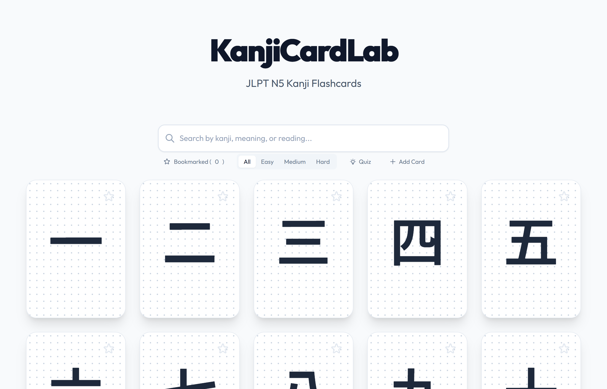
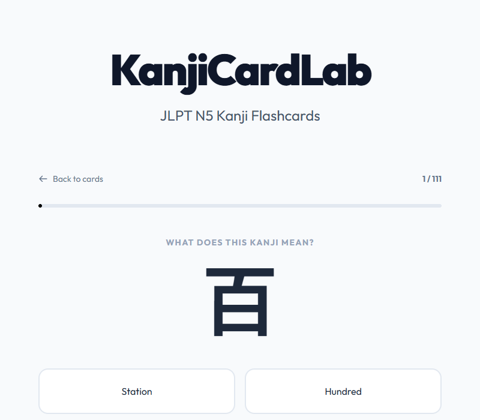

# KanjiCardLab – JLPT N5 Kanji Flashcards

An interactive web-based kanji flashcard app for JLPT N5 learners. Study 111 essential kanji with flashcards, bookmarks, filters, and a 4-choice quiz mode.

JLPT N5レベルの漢字111字を収録したインタラクティブなフラッシュカードアプリです。


<!-- Replace with an actual demo GIF or screenshot -->

## Features / 機能

- **Flashcards with 3D flip animation** – Front shows kanji, back shows meaning, readings, example sentence, and origin story
- **Search & Filter** – Search by kanji, meaning, or reading. Filter by difficulty (Easy / Medium / Hard)
- **Bookmarking** – Star your favorite kanji. Bookmarks persist via localStorage
- **Quiz Mode** – 4-choice quiz with two modes:
  - Kanji → Meaning
  - Meaning → Kanji
- **Quiz Source Selection** – Quiz from bookmarked kanji, all kanji, or by difficulty
- **Progress Tracking** – Progress bar and results screen with mistake review
- **Responsive Design** – Works on mobile, tablet, and desktop

| Flashcard View | Quiz Mode |
|:-:|:-:|
|  |  |
<!-- Replace with actual screenshots -->

## Tech Stack / 技術スタック

| Category | Technology |
|----------|-----------|
| Markup | HTML5 (single-page app) |
| Styling | [Tailwind CSS](https://tailwindcss.com/) (CDN) |
| Reactivity | [Alpine.js](https://alpinejs.dev/) 3.x (CDN) |
| Font | [Outfit](https://fonts.google.com/specimen/Outfit) (Google Fonts) |
| Storage | localStorage |
| Build | None – zero build step |

## Getting Started / はじめに

### Open directly / 直接開く

```bash
# Just open index.html in your browser
open index.html
```

### Local server / ローカルサーバー

```bash
# Python
python -m http.server 3000

# Node.js
npx serve .
```

Then open `http://localhost:3000` in your browser.

## Project Structure / プロジェクト構成

```
KanjiCardLab-N5/
├── index.html          # Complete app (HTML + CSS + JS + data)
├── add_diff.py         # Script to assign difficulty levels
├── update_kanji.py     # Script to enrich kanji data
├── rebuild.py          # Script to enhance HTML/CSS
├── .claude/
│   └── launch.json     # Dev server config
└── docs/               # Screenshots (add your own)
```

The entire app is a single `index.html` (~67 KB) with no external dependencies beyond CDN-loaded libraries.

## Kanji Data / 漢字データ

111 JLPT N5 kanji, each containing:

| Field | Description |
|-------|------------|
| `kanji` | Character (e.g. 山) |
| `meaning` | English meaning |
| `reading` | On-yomi / Kun-yomi |
| `example` | Example sentence (Japanese) |
| `exampleReading` | Romanized reading |
| `exampleTranslation` | English translation |
| `origin` | Etymology / origin story |
| `difficulty` | easy / medium / hard |

### Difficulty Distribution / 難易度分布

- **Easy** – Basic strokes, numbers, simple forms (一, 二, 三, 山, 川, 人 ...)
- **Medium** – Compound characters (高, 安, 新, 古 ...)
- **Hard** – Complex characters (雨, 天, 電, 魚, 語 ...)

## License / ライセンス

MIT

---

<p align="center">
  Built for kanji learners preparing for JLPT N5<br>
  漢字学習者のために作られたアプリ
</p>
